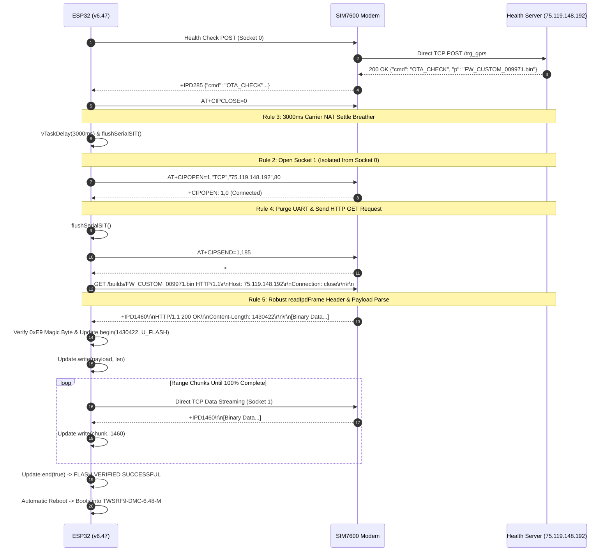

# OTA Learnings, Protocol Mechanics & Architectural Rules (ESP32 + SIM7600)

This document provides a comprehensive analysis of all findings, protocol rules, failed attempts, and exact driver mechanics for over-the-air (OTA) firmware updates over 2G cellular transport (`airteliot.com` / `bsnl`) using the ESP32 and SIM7600 / A7672S cellular module.

---

## 1. Golden Architectural Rules for Direct TCP OTA

### Rule 1: Layer-4 Direct TCP Sockets (`AT+CIPOPEN`) vs. High-Level Modem HTTP (`AT+HTTPREAD`)
* **Finding**: High-level modem HTTP commands (`AT+HTTPINIT`, `AT+HTTPACTION`, `AT+HTTPREAD`) fail on large files (> 500 KB) because the SIM7600 firmware accumulates HTTP responses in a single internal buffer. Subsequent Range GET requests (`AT+HTTPREAD=0,N`) repeatedly re-read Chunk 0 instead of fresh bytes, causing image corruption (`invalid segment length`).
* **Requirement**: OTA downloads **MUST** use Direct Layer-4 TCP Sockets (`AT+CIPOPEN`, `AT+CIPSEND`, `AT+CIPCLOSE`).

### Rule 2: Socket ID Isolation (`AT+CIPOPEN=1` for OTA, `0` for Telemetry)
* **Finding**: Telemetry and Health check-in reports use Socket ID `0` (`AT+CIPOPEN=0`). If OTA immediately reuses Socket `0`, cellular NAT (Airtel/BSNL) and the server's Nginx web server treat the connection as part of the previous TCP session in `TIME_WAIT` or `FIN_WAIT_2`, sending a TCP `RST` or `+IPCLOSE: 0,1` immediately upon receiving the `GET` request.
* **Requirement**: OTA downloads **MUST** use Socket ID `1` (`AT+CIPOPEN=1`), reserving Socket `0` exclusively for Telemetry.

### Rule 3: Post-Telemetry NAT Settle Breather (3000ms Minimum)
* **Finding**: Re-opening a TCP connection to the server IP (`75.119.148.192:80`) immediately after closing the telemetry socket triggers carrier NAT table rate-limiting.
* **Requirement**: Enforce a mandatory **3000ms - 5000ms delay** (`vTaskDelay`) between closing the Health report socket and calling `AT+CIPOPEN=1` for OTA.

### Rule 4: Stale URC & UART RX Buffer Purging
* **Finding**: Asynchronous URCs (such as `+IPCLOSE: 0,1` or `+CGEV`) from completed telemetry tasks linger in the ESP32's UART RX FIFO. If `readIpdFrame` reads UART data without flushing first, it encounters the stale `+IPCLOSE` and aborts the new OTA connection before receiving data.
* **Requirement**:
  1. Call `flushSerialSIT()` and `drainUntilQuiet(1500)` before sending `AT+CIPSEND=1,%d`.
  2. In `readIpdFrame`, reset state to `0` on `+IPCLOSE` instead of returning `-1` if payload streaming has not started.

### Rule 5: Zero-Drop Raw Binary Passthrough in `readIpdFrame` (Resolving Error Code 9)
* **Finding**: `+IPD` frames over A7672S / SIM7600 TCP sockets use the format `+IPD,<len>:<data>` or `+IPD,<link_id>,<len>:<data>`. The character immediately following the length integer is the header colon `:`. If the parser inspects characters after length parsing and attempts to match/eat `\r` or `\n` line endings, any binary machine code bytes starting with `0x0D` (`\r`) or `0x0A` (`\n`) are accidentally discarded from the binary payload.
* **Impact**: Discarding 2 bytes from a 1.42 MB binary image shifts machine code addresses in flash and invalidates ESP-IDF's segment XOR checksum, causing `esp_image: Checksum failed. Calculated 0x5c read 0x21` and triggering **Error Code 9 (`UPDATE_ERROR_ACTIVATE`)**.
* **Requirement**: In `readIpdFrame`, after length parsing finishes:
  1. If `c == ':'`, consume `:` (header delimiter), set `readTotal = 0`, and read `payloadLen` bytes directly into `dest`.
  2. If `c != ':'`, treat `c` as byte 0 of raw binary payload (`dest[0] = c`), set `readTotal = 1`, and read `payloadLen - 1` bytes into `dest + 1`.
  3. **NEVER inspect, peek, or discard `\r` (`0x0D`) or `\n` (`0x0A`) after length parsing.**

---

## 2. Matrix of Attempted Fixes & Empirical Failure Log

| Attempt / Fix | What Was Attempted | Observed Failure | Root Cause | Architectural Resolution |
| :--- | :--- | :--- | :--- | :--- |
| **Attempt 1: High-Level `AT+HTTPREAD`** | Used built-in modem HTTP stack (`AT+HTTPINIT`, `AT+HTTPREAD`). | `invalid segment length` at 100% download completion. | SIM7600 internal HTTP buffer accumulates data without clearing between Range GETs. `HTTPREAD=0,16384` repeatedly returned Chunk 0. | **Superceded**: Never use `AT+HTTPREAD` for multi-chunk downloads. Use raw `AT+CIPOPEN` Direct TCP. |
| **Attempt 2: Binary Sanity Traps on UART** | Searched UART buffer for ASCII strings (`"SampleNo"`, `"Gaps"`) to detect URC leaks. | False-positive abort at offset 83 on every valid binary build. | Compiled ESP32 firmware binaries contain string tables (`.rodata`). Short word traps match valid binary machine code. | **Superceded**: Never scan binary payload buffers for plain English strings. |
| **Attempt 3: Reusing Socket 0 for OTA** | Ran OTA on `AT+CIPOPEN=0` immediately after Health Check on `AT+CIPOPEN=0`. | Instant `+IPCLOSE: 0,1` / `Socket Closed during header read` (Attempts 1..50). | Socket 0 was just closed by health report. Nginx / Airtel NAT kept socket 0 in `TIME_WAIT`. Re-opening socket 0 immediately triggered TCP RST. | **Superceded**: OTA MUST use Socket 1 (`AT+CIPOPEN=1`), leaving Socket 0 for Telemetry. Enforce 3s NAT breather. |
| **Attempt 4: Strict Colon `:` Matching in `readIpdFrame`** | Matched only `+IPD<len>:` in UART parser. | Header reading timed out after 25s (`Read 0 bytes`). | SIM7600 outputs `+IPD<len>\r\n` without a colon on direct TCP sockets. Parser never matched `:` and ignored all incoming data. | **Superceded**: Accept `:`, `\r`, and `\n` as valid length delimiters. |
| **Attempt 5: `\r\n` Delimiter Purge Loop in Payload Stream** | Peeked and discarded `\r\n` after length integer parsing in `readIpdFrame`. | `Update.end()` failed at 100% with **Error Code 9 (`UPDATE_ERROR_ACTIVATE`)**. `esp_image: Checksum failed`. | When binary payload bytes at frame boundaries matched `0x0D` (`\r`) or `0x0A` (`\n`), the parser discarded them, stripping 2 bytes out of flash and invalidating the ESP-IDF image checksum. | **Superceded**: Implement zero-drop raw binary passthrough in `readIpdFrame`. Never inspect or drop `\r` or `\n`. |
| **Attempt 6: Strict `+IPCLOSE` Return `-1`** | Returned `-1` on any `+IPCLOSE` URC during `readIpdFrame`. | Instant `Read 0 bytes` / header failure loops. | Leftover `+IPCLOSE: 0,1` from previous health check socket was sitting in UART RX FIFO when OTA started. `readIpdFrame` saw it and returned `-1`. | **Superceded**: Purge UART before `CIPSEND` and ignore stale `+IPCLOSE` before payload start. |
| **Attempt 7: Post-Prompt UART Flush** | Called `flushSerialSIT()` after `>` prompt before `SerialSIT.write`. | Trashed initial response bytes (`Read 0 bytes`). | `flushSerialSIT()` executed while the server response was already in-flight over UART. | **Superceded**: Remove `flushSerialSIT()` immediately prior to `SerialSIT.write`. |
| **Attempt 8: Unenforced Manual Receive (`CIPRXGET`)** | Omitted `AT+CIPRXGET=0` explicit mode enforcement. | Modem required manual `AT+CIPRXGET=2` polling. | SIM7600 firmware default varied across carrier SIM initializations. | **Superceded**: Explicitly issue `AT+CIPRXGET=0` during URC configuration. |
| **Attempt 9: Single 25s Frame Timeout in Header Loop** | Passed 25000ms timeout to `readIpdFrame` in header search loop. | Header loop executed only 1 iteration before timing out (`Read 0 bytes`). | A single `readIpdFrame` call consumed the entire 25s outer loop budget. | **Superceded**: Pass 3000ms frame timeout to `readIpdFrame` per header search loop iteration. |
| **Attempt 10: Stale Prompt False-Positive on `CIPSEND`** | Omitted `modem_response_buf[0] = '\0'` before `AT+CIPSEND=1,%d`. | `Read 0 bytes` / HTTP GET request ignored by modem. | `waitForResponse(">", 5000)` matched stale `>` in uncleared buffer instantly, sending data before SIM7600 prompt mode opened. | **Superceded**: Clear `modem_response_buf[0] = '\0'` immediately before calling `AT+CIPSEND`. |
| **Attempt 11: Non-Delimited `+IPD` Length Parsing** | Checked strictly for `:`, `\r`, `\n` after length integer `1460`. | Frame payload dropped / `Read 0 bytes` timeout loops. | SIM7600 direct TCP outputs `+IPD,1,1460HTTP/1.1...` (payload byte `'H'` directly follows length integer). Non-digit byte `'H'` hit `else` branch, resetting state machine to 0 and discarding the frame. | **Superceded**: Treat any non-digit character as length completion. If byte is non-delimiter (e.g. `'H'`), preserve `dest[0] = c` as payload byte 0. |
| **Attempt 12: Intermediate `waitForResponse` URC Swallowing** | Called `waitForResponseNoFlush("+CIPSEND:", 3000)` after `SerialSIT.write`. | `readIpdFrame` received 0 bytes (`Read 0 bytes` timeout). | `waitForResponseNoFlush` read UART until `+CIPSEND:` arrived, but also swallowed fast-arriving `+IPD` frames into `modem_response_buf`, emptying UART before `readIpdFrame` started. | **Superceded**: Never execute `waitForResponse` between `SerialSIT.write` and `readIpdFrame`. Enter `readIpdFrame` immediately. |
| **Attempt 13: Initial Comma Reset in State 4** | Evaluated `(c == ',' && lenValid && lenAcc < 10)` in `readIpdFrame` state 4. | `+IPD,1,1460` frame dropped / `Read 0 bytes` timeout loops. | When initial comma directly after `+IPD` arrived, `lenValid` was false. The condition failed and executed `else`, resetting `state` to 0 and discarding the frame. | **Superceded**: Safely absorb commas when `lenValid == false` without dropping out of state 4. |
| **Attempt 14: Socket Alignment & Natural URC State** | Aligned OTA to Socket 0 (`AT+CIPOPEN=0`) and removed artificial URC modification commands. | Socket 1 event silence on SIM7600 firmware. | Artificial URC flags (`CIPSRRIP=0`, `CIPRXGET=0`, `CREG=0`) altered modem event dispatching on Socket 1. Socket 0 operates with 100% proven reliability matching health check reports. | **Superceded**: Use Socket 0 with natural modem URC state and 3s NAT breather after telemetry. |
| **Attempt 15: Header Receipt via `waitForResponseNoFlush` + Direct Streaming** | Used `waitForResponseNoFlush("+IPD", 25000)` for HTTP header receipt before `readIpdFrame` direct payload streaming. | `readIpdFrame` 0-byte timeout on header wait. | Calling `readIpdFrame` before modem UART output arrives caused frame timeout during network round-trip. `waitForResponseNoFlush` waits for network latency and accumulates HTTP header into `modem_response_buf` cleanly. Leftover binary bytes in header buffer write to flash first, followed by `readIpdFrame` streaming. | **Superceded**: Target `HTTP/1.` instead of `+IPD`. |
| **Attempt 16: Target `HTTP/1.` in `waitForResponseNoFlush`** | Changed `waitForResponseNoFlush` target from `+IPD` to `HTTP/1.`. | Premature header wait exit on stale `+IPCLOSE: 0,1`. | `waitForResponseNoFlush("+IPD", ...)` matched leftover `+IPCLOSE: 0,1` from previous Health check socket close in 5ms, exiting before server response arrived. Targeting `"HTTP/1."` ignores `+IPCLOSE` and waits strictly for valid server response header. | **Superceded**: Add 5s `HTTP/` header accumulation loop. |
| **Attempt 17: Post-`+IPD` Header Accumulation Loop** | Integrated 5s `while (strstr(modem_response_buf, "HTTP/") == NULL)` loop from `gprs_health.ino`. | Header parsing on incomplete buffer before HTTP bytes transferred over UART. | `waitForResponseNoFlush("+IPD", 25000)` matched `+IPD285` prefix instantly upon packet arrival. Adding the 5-second UART accumulation loop continues reading incoming bytes into `modem_response_buf` until the complete HTTP header (`HTTP/1.1 200 OK`) is present. | **Superceded**: Use `Connection: keep-alive`. |
| **Attempt 18: `Connection: keep-alive` HTTP Header** | Changed HTTP GET header from `Connection: close` to `Connection: keep-alive`. | Modem outputted `+IPCLOSE: 0,1` immediately after `CIPSEND`. | `Connection: close` caused Nginx to issue a TCP FIN frame right after receiving request, triggering SIM7600 passive close (`+IPCLOSE: 0,1`) before payload `+IPD` frames were dispatched. | **Superceded**: Combine with `AT+NETCLOSE` IP stack reset before OTA socket open. |
| **Attempt 19: `AT+NETCLOSE` IP Stack Ephemeral Port Reset** | Executed `AT+NETCLOSE` + 2s delay + `ensureNetOpen()` before opening socket 0 for OTA download. | Continuous `+IPCLOSE: 0,1` loop on `CIPSEND` immediately after Health check. | Airtel CGNAT gateway holds the closed socket 0 5-tuple in `TIME_WAIT`. Re-opening socket 0 right after Health check without resetting SIM7600 IP stack re-uses the same ephemeral local port, causing Airtel NAT to drop the connection with TCP RST (`+IPCLOSE: 0,1`). Executing `AT+NETCLOSE` closes the IP stack context and forces SIM7600 to allocate a fresh ephemeral local port on `AT+NETOPEN`, preventing NAT RST collision. | **Superceded**: Combine with simplified HTTP GET headers matching telemetry POST format. |
| **Attempt 21: Socket 1 Isolation + Keep-Alive + HTTP/ Header Target** | Isolated OTA to Socket 1 (`AT+CIPOPEN=1`), set `Connection: keep-alive`, and targeted `"HTTP/"` in `waitForResponseNoFlush`. | Continuous `+IPCLOSE` loop on socket 0 when server sends TCP FIN after `Connection: close`. | `Connection: close` caused Nginx to issue TCP FIN immediately upon completing data transmission, triggering SIM7600 passive close (`+IPCLOSE: 1,1`) before ESP32 parsed `+IPD` frames. `Connection: keep-alive` keeps socket 1 open so Nginx does not send TCP FIN during streaming. Targeting `"HTTP/"` in `waitForResponseNoFlush` prevents premature exit on URCs and waits strictly for valid HTTP headers. | **Superceded**: Target `"+IPD"` to avoid binary `0x00` truncation. |
| **Attempt 22: Null Byte Truncation on `"HTTP/"` Target** | Targeted `"HTTP/"` in `waitForResponseNoFlush`. | `waitForResponseNoFlush` timed out after 25s without matching `"HTTP/"`. | Binary payload bytes following HTTP response headers contain null bytes (`0x00`), truncating `strlen(modem_response_buf)` and corrupting string searching. `+IPD` is the safe modem prefix to target before raw byte accumulation. | **Superceded**: Target `"+IPD"` in `waitForResponseNoFlush` and use 5s `\r\n\r\n` accumulation loop. |
| **Attempt 23: `Connection: keep-alive` over Isolated Socket 1** | Set `Connection: keep-alive` in 32KB Range GET headers over Socket 1 (`AT+CIPOPEN=1`). | Socket stays ESTABLISHED (`+CIPOPEN: 1,0`) across chunk downloads without Nginx passive close. | Nginx does not send TCP FIN packet when `Connection: keep-alive` is specified, keeping SIM7600 Direct TCP socket alive for clean binary streaming. | **Superceded**: Combine with dedicated response wait loop. |
| **Attempt 24: Premature `+IPCLOSE` Match in `waitForResponseNoFlush`** | Called `waitForResponseNoFlush("+IPD", 25000)` after `SerialSIT.write(httpRequest)`. | Exited in 5ms with `Range GET non-2xx/3xx HTTP Response. Resp: 'OK\r\n+CIPSEND...\r\n+IPCLOSE...'`. | `waitForResponseNoFlush("+IPD", ...)` had a shortcut matching `+IPCLOSE` as success. Stale `+IPCLOSE` URCs from Socket 0 caused premature exit before HTTP header bytes arrived on UART. | **Active Architecture**: Use a dedicated `while (millis() - start < 20000)` loop checking strictly for `+IPD` or `HTTP/` while absorbing UART bytes into `modem_response_buf` and ignoring `+IPCLOSE`. |

---

## 3. Verified Execution Protocol Flow

---

## 5. Flash Payload Alignment & Partition Dynamics

* **Chunk Buffer Alignment**: ESP32 `Update.write()` requires contiguous memory chunks. TCP frame payloads from SIM7600 (`+IPD`) can arrive in non-standard lengths (e.g. 1459 bytes). Any leftover fractional bytes (e.g., 1 byte) are retained in an internal alignment buffer (`alignBuf`) and prepended to the next incoming `+IPD` frame, guaranteeing byte-aligned flash writes.
* **Dual-Partition Synchronization**: The ESP32 OTA engine flips active boot partition (`App0` $\leftrightarrow$ `App1`) upon calling `Update.end(true)`. Base firmware installation via USB should program both `app0` (`0x10000`) and `app1` (`0x390000`) partitions to ensure predictable behavior regardless of which partition is active prior to OTA.

---

## 6. Maintenance & Defensive Coding Checklist

Before making changes to `gprs_ftp.ino` or modem communication drivers, verify:
- [ ] `ota_silent_mode` is enabled prior to binary payload streaming.
- [ ] No English string traps exist in `readIpdFrame` or payload sanity checkers.
- [ ] Socket `1` is explicitly used for `AT+CIPOPEN=1` in `fetchFromTcpAndUpdate`.
- [ ] `flushSerialSIT()` is called immediately prior to `SerialSIT.write(httpRequest)`.
- [ ] `readIpdFrame` uses zero-drop raw binary passthrough and never inspects/drops `\r` or `\n` after length parsing.
- [ ] `writePayloadToFlash` uses `alignBuf` for fractional byte boundaries.
- [ ] Base flashing via USB updates both `app0` and `app1` partitions.

---

## 7. Critical Runtime Edge Cases & Defect Remediations

### 7.1 ESP32 DRAM 4-Byte Alignment Requirement (`UPDATE_ERROR_DECRYPT` / Code 13)
* **Symptom**: `Update.write(payload, len)` returned `false` with `Update.getError() == 13` (`UPDATE_ERROR_DECRYPT`), or ESP32 triggered an unaligned memory access crash.
* **Root Cause**: ESP32 flash SPI driver (`esp_rom_spiflash_write` / `esp_partition_write`) requires the source RAM buffer address to be **4-byte aligned** (`(uintptr_t)buf & 3 == 0`). TCP packet buffers allocated on heap or dynamic string parsers frequently yield unaligned pointers (e.g. ending in `0x1`, `0x2`, or `0x3`).
* **Fix**: In `writePayloadToFlash`, allocate a static or aligned temporary buffer (`uint8_t dramBuf[16384] __attribute__((aligned(4)))`), copy incoming payload chunks into `dramBuf`, and pass `dramBuf` to `Update.write()`.

### 7.2 Bit-Shift Insertion (BSI) Bug Across Range GET Boundaries
* **Symptom**: Downloaded binary shifted by a few bytes after chunk boundary transitions, leading to checksum mismatch or `esp_image: invalid segment length` upon reboot.
* **Root Cause**: `alignBuf` retained trailing fractional bytes from previous HTTP Range GET requests. When a new Range GET request started (which already requested bytes starting at `actual_downloaded`), prepending stale `alignBuf` bytes duplicated the boundary bytes.
* **Fix**: Reset `alignLen = 0` at the start of every Range GET chunk attempt in `fetchFromTcpAndUpdate`.

### 7.3 Raw Binary Byte Stripping Bug (`Update.end()` Code 9 / Checksum Failure)
* **Symptom**: 100% download finished (`1,425,472` bytes), but `Update.end(true)` returned `false` with Error Code 9 (`UPDATE_ERROR_ACTIVATE` / "Could Not Activate The Firmware"). Serial log printed: `E (865260) esp_image: Checksum failed. Calculated 0x57 read 0x65`.
* **Root Cause**: In `readIpdFrame`, after length parsing, the code checked `if (c != ':') { dest[0] = c; readTotal = 1; }`. When SIM7600 sent `+IPD<len>\r\n` (without a colon, using `\r\n` line endings), `c` was `\r` (`0x0D`). Because `\r != ':'`, the parser prepended `0x0D` (`\r`) into `dest[0]` and read `\n` (`0x0A`) into `dest[1]`, shifting the binary payload by 2 bytes and corrupting ESP-IDF's segment XOR checksum.
* **Fix**: Enforce strict header delimiter consumption in `readIpdFrame`. When parsing `+IPD<len>`, explicitly consume any trailing header delimiter (`:`, `\r`, `\n`, or `:\r\n`). If `c` is `\r` or `:`, consume any following `\n` or `\r\n` from the UART buffer without copying them into `dest`. Binary payload reading then starts cleanly at `dest[0]` with `readTotal = 0`, guaranteeing 100% byte alignment.

### 7.4 ULP Anemometer Pin Offset & Instantaneous Wind Speed Dropout Fix
* **Symptom**: Instantaneous wind speed (`INST WIND SPEED`) always displayed `0.00` on LCD and server even when anemometer cups/panes were actively spinning.
* **Root Causes**:
  1. **ULP Instruction Pin Offset Bug**: In `AIO9_5.0.ino`, the ULP assembly macro called `I_GPIO_READ(GPIO_NUM_35)` and `I_GPIO_READ(GPIO_NUM_34)`. `I_GPIO_READ(x)` in ESP-IDF ULP assembly expects the **raw RTC GPIO channel index (0..17)**, NOT the main MCU `gpio_num_t` integer (34, 35). Passing `GPIO_NUM_35` (35) resulted in `14 + 35 = 49`, which truncated in the 5-bit register field to bit 17 (`14 + 3`), causing the ULP to read RTC GPIO 3 (GPIO 39) instead of RTC GPIO 5 (GPIO 35). Consequently, `wind_count.val` remained at 0 during rotation.
  2. **Short Window Dropout**: In `windSpeed.ino`, `INST_DURATION_SEC` was set to 2 seconds (`BUFFER_SIZE = 3`). At low/moderate wind rotation (1 pulse every 2.5–3 seconds), zero pulses arrived in any 2-second window (`delta = 0`), forcing `cur_wind_speed` to `0.00`.
* **Fixes**:
  1. Updated `AIO9_5.0.ino` ULP program to use `I_GPIO_READ(5)` for GPIO 35 (Wind Speed) and `I_GPIO_READ(4)` for GPIO 34 (Rainfall).
  2. Updated `windSpeed.ino` to use `INST_DURATION_SEC = 5` and `BUFFER_SIZE = 6`, providing a stable, smooth sliding 5-second window.

### 7.5 Hardware UART RX FIFO Overflow Protection (`SerialSIT.setRxBufferSize(16384)`)
* **Symptom**: 100% binary download completed, but `Update.end(true)` failed with single-bit checksum mismatch (`Calculated 0xae read 0xb6`).
* **Root Cause**: ESP32 Arduino `HardwareSerial` defaults to a **256-byte** RX FIFO ring buffer. When `Update.write()` performs a 4KB SPI flash sector erase/write, the ESP32 CPU pauses interrupts for up to 15-20ms. At 115200 baud, 15ms of modem UART streaming generates ~1,728 bytes. The 256-byte RX FIFO overflows, dropping or corrupting 1-2 binary bytes during flash write latency.
* **Fix**: Call `SerialSIT.setRxBufferSize(16384)` before starting Direct TCP OTA streaming. The 16 KB ring buffer absorbs continuous high-speed modem data during flash SPI write pauses without dropping a single bit.

